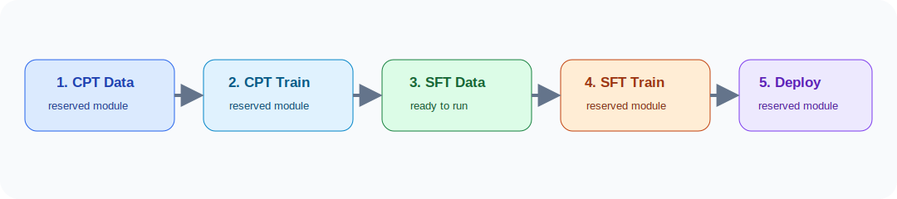

<p align="center">
  
</p>

<p align="center">
  <a href="README_en.md">English</a> | <b>中文</b>
</p>

<p align="center">
  
  
  
  
</p>

# ORProject: 面向运筹优化领域 LLM 的后训练流水线

ORProject 是一个面向 Operations Research / Mathematical Optimization 领域的 LLM 后训练开源项目。项目采用流水线结构组织，从领域语料构建、持续预训练、SFT 数据构建、SFT 训练，到最终模型下载与部署，逐步形成完整的 OR 领域模型后训练方案。

当前仓库中 **第 3 步：SFT 数据集构建** 已经可运行；**第 2 步：CPT 训练示范** 和 **第 4 步：SFT 训练示范** 已接入 MindSpeed-LLM 启动模板。其余步骤先预留目录和说明，后续逐步填充。

<p align="center">
  
</p>

## 1. CPT 数据集构建

 入口：[cpt_data_construction](cpt_data_construction/)

当前状态：预留。

后续将补充：

- OR 领域原始语料收集；
- 文档清洗、去重和格式标准化；
- 领域相关性过滤；
- tokenizer length packing；
- CPT 数据集 card 和发布脚本。

## 2. CPT 训练示范

 入口：[cpt_training](cpt_training/)

当前状态：已接入 MindSpeed-LLM 训练模板。

这一阶段提供 DeepSeek-V4-Flash 风格的 CPT 示例脚本，覆盖：

- CPT 文本语料转换为 MindSpeed indexed dataset；
- HF checkpoint 与 MindSpeed/Megatron-Core checkpoint 互转；
- 多机多卡 CPT 启动模板；
- checkpoint、TensorBoard、archive 和可选 model registry 输出规范。

最小使用示例：

```bash
cd ORproject/cpt_training

export MINDSPEED_LLM_DIR=/path/to/MindSpeed-LLM
export MINDSPEED_DIR=/path/to/MindSpeed
export TOKENIZER_PATH=/path/to/DeepSeek-V4-Flash
export CKPT_LOAD_DIR=/path/to/deepseek4_flash_mcore
export OUTPUT_ROOT=/path/to/training_outputs/cpt
export TRAIN_DATA_PATH=$'1.0 /path/to/processed/or_corpus_text_document'

bash scripts/train_cpt_deepseek4_flash_4k.sh
```

详细说明见：[cpt_training/README.md](cpt_training/README.md)。

## 3. SFT 数据集构建

 入口：[sft_data_construction](sft_data_construction/)

当前状态：已可运行。

这一阶段负责把少量高质量 OR 建模问答种子扩展成更大规模的 SFT 数据。核心流程是：

```text
problem-answer seeds
  -> generic modeling IR
  -> synthetic modeling IR
  -> rendered problem
  -> rendered answer
  -> quality gate
  -> SFT JSONL
```

已支持能力：

- 公开 seed pool：`sft_data_construction/seeds/public_seed.jsonl`
- DP / DT / DPS 三种题目数据呈现模式
- 通用 OR bucket：domain、structure、difficulty、data interface、answer style
- Synthetic IR -> problem -> answer 三阶段生成
- target bucket 控制，降低领域塌缩
- request cache，避免重复 API 调用
- accepted target top-up：`target_count` 表示最终需要的通过样本数
- 多轮补足：`generation_oversample` + `max_rounds`
- 断点续跑：`resume: true`
- 多 API endpoint：`llm.base_urls` + `workers_per_api`
- 流式落盘：中断后已完成样本不会丢
- 相似度门控：避免新题和 seed / 本轮样本过像
- surplus 池：超出 quota 但合格的数据单独保存，可作为后续飞轮素材

### 3.1 安装

```bash
cd ORproject/sft_data_construction
python -m pip install -e .
```

也可以不安装，运行时使用：

```bash
PYTHONPATH=src python -m or_data_distill --help
```

### 3.2 校验公开 seed

```bash
cd ORproject/sft_data_construction
python -m or_data_distill validate-sft --input seeds/public_seed.jsonl
```

预期输出：

```json
{
  "rows": 200,
  "rows_with_issues": 0
}
```

### 3.3 Dry-run 检查配置

```bash
python -m or_data_distill run \
  --config examples/configs/demo.yaml \
  --dry-run
```

dry-run 不调用 LLM，只生成请求和 manifest，用于确认配置是否可解析。

### 3.4 使用真实 API 生成数据

复制配置：

```bash
cp configs/run.example.yaml configs/run.local.yaml
```

编辑 `configs/run.local.yaml`：

```yaml
run:
  run_id: sft_data_demo
  output_root: runs
  target_count: 200
  max_rounds: 3
  generation_oversample: 1.5
  concurrency: 16
  resume: true

paths:
  seeds: seeds/public_seed.jsonl
  synthetic_pool: []

llm:
  base_url: http://YOUR_HOST:PORT/v1
  model: your-model-name
  api_key_env: LLM_API_KEY
  temperature: 0.7
  top_p: 0.9
  max_tokens: 4096
  timeout_seconds: 240
  disable_proxy: true

cache:
  enabled: true
  dir: cache/chat

quality:
  problem_similarity_threshold: 0.9
  compare_to_seeds: true
  compare_to_run: true
```

启动：

```bash
export LLM_API_KEY=YOUR_KEY_IF_NEEDED
python -m or_data_distill run --config configs/run.local.yaml
```

查看结果：

```bash
python tools/inspect_run.py --run-dir runs/sft_data_demo
python -m or_data_distill validate-sft --input runs/sft_data_demo/sft.jsonl
```

关键输出：

```text
runs/<run_id>/sft.jsonl                       最终 accepted SFT 数据
runs/<run_id>/accepted_synthetic_pool.jsonl   可用于下一轮飞轮的 Synthetic IR
runs/<run_id>/surplus_sft.jsonl               quota 已满后额外通过的数据
runs/<run_id>/surplus_synthetic_pool.jsonl    surplus 对应的 IR
runs/<run_id>/rejected.jsonl                  被质量门/API/格式拒绝的数据
runs/<run_id>/attempts.jsonl                  每次尝试的状态
runs/<run_id>/manifest.json                   运行汇总
```

### 3.5 数据飞轮续跑

第一轮生成完成后，下一轮可以使用上一轮 accepted pool 作为父样本上下文：

```yaml
paths:
  seeds: seeds/public_seed.jsonl
  synthetic_pool:
    - runs/sft_data_demo/accepted_synthetic_pool.jsonl

parent_pool:
  parent_pool_mode: hybrid
  synthetic_parent_share: 0.5
  parent_match_top_k: 8
  parent_usage_penalty: 0.25
```

更激进的滚雪球式扩展：

```yaml
parent_pool:
  parent_pool_mode: snowball
  synthetic_parent_share: 0.75
```

### 3.6 多 API 并行

```yaml
llm:
  base_urls:
    - http://HOST_A:8000/v1
    - http://HOST_B:8000/v1
  workers_per_api: 32
  model: your-model-name
```

总并发约为：

```text
len(base_urls) * workers_per_api
```

## 4. SFT 训练示范

 入口：[sft_training](sft_training/)

当前状态：已接入 MindSpeed-LLM 训练模板。

这一阶段负责把第 3 步产出的 OpenAI-style `messages` JSONL 转换为 MindSpeed packed instruction dataset，并启动 SFT：

```bash
cd ORproject/sft_training

export MINDSPEED_LLM_DIR=/path/to/MindSpeed-LLM
export MINDSPEED_DIR=/path/to/MindSpeed
export TOKENIZER_PATH=/path/to/DeepSeek-V4-Flash
export CKPT_LOAD_DIR=/path/to/source_mcore_checkpoint
export OUTPUT_ROOT=/path/to/training_outputs/sft

bash scripts/convert_data.sh \
  --mindspeed-llm-dir "$MINDSPEED_LLM_DIR" \
  --input ../sft_data_construction/runs/sft_data_demo/sft.jsonl \
  --output-prefix /path/to/processed/or_sft/openai \
  --tokenizer "$TOKENIZER_PATH" \
  --handler-name SharegptStyleInstructionHandler \
  --prompt-type deepseek4 \
  --map-keys '{"messages":"messages","tags":{"role_tag":"role","content_tag":"content","user_tag":"user","assistant_tag":"assistant","system_tag":"system"}}' \
  --seq-length 8192 \
  --workers 8 \
  --n-subs 16 \
  --no-append-eod

export DATA_PATH=/path/to/processed/or_sft/openai
bash scripts/launch_sft_deepseek4_flash_8n16_910c.sh
```

详细说明见：[sft_training/README.md](sft_training/README.md)。

## 5. 现有模型下载与部署命令

 入口：[model_download_deployment](model_download_deployment/)

当前状态：已加入 FP8 -> BF16 权重准备脚本；模型下载、推理部署与服务化示例后续补充。

已提供：

- `model_download_deployment/scripts/convert_ckpt_fp8_to_bf16.sh`：将 DeepSeek-V4 FP8 HuggingFace checkpoint 转为 BF16 HuggingFace checkpoint。

后续将补充：

- 已发布模型列表；
- 模型下载命令；
- 本地推理服务启动命令；
- OpenAI-compatible API 部署示例；
- 不同硬件环境下的部署注意事项。

## 项目结构

```text
ORproject/
├── cpt_data_construction/       # 1. CPT 数据集构建，预留
├── cpt_training/                # 2. CPT 训练示范，MindSpeed 模板
├── sft_data_construction/       # 3. SFT 数据集构建，已可运行
├── sft_training/                # 4. SFT 训练示范，MindSpeed 模板
├── model_download_deployment/   # 5. 模型下载与部署命令，含 FP8 -> BF16 权重准备脚本
├── assets/icons/                # README 图标和流程图
├── docs/                        # 扩展文档，预留
├── examples/                    # 端到端示例，预留
├── README.md                    # 中文版
└── README_en.md                 # English version
```

## 引用

Citation 信息会在 CPT 数据构建与模型发布模块补齐后统一整理。
