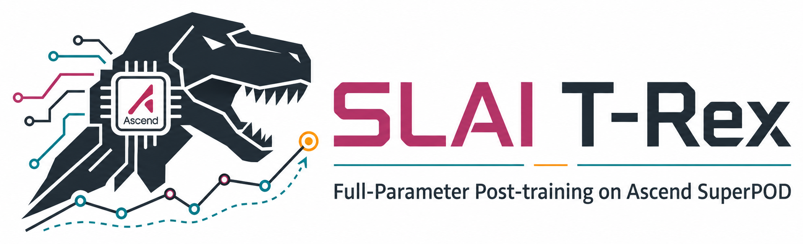
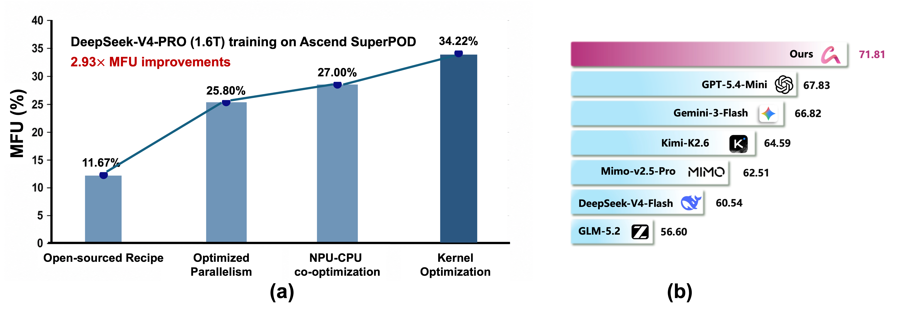

<p align="center">
  
</p>

<p align="center">
  <a href="README.md">English</a> | <b>中文</b>
</p>

<p align="center">
  <a href="SLAI%20T-Rex.pdf"></a>
  <a href="https://www.modelscope.cn/models/SLAIAITP/DeepSeek-V4-Flash-OR"></a>
  <a href="https://github.com/SLAI-AITP/SLAI-T-Rex"></a>
  <br>
  
  
  
  
</p>

# SLAI T-Rex

**SLAI T-Rex** 是技术报告配套的开源仓库：

**论文：** [SLAI T-Rex: Full-Parameter Post-training of the DeepSeek-V4 Family on Ascend SuperPOD](SLAI%20T-Rex.pdf)  
**模型：** [SLAIAITP/DeepSeek-V4-Flash-OR](https://www.modelscope.cn/models/SLAIAITP/DeepSeek-V4-Flash-OR)  
**代码：** [SLAI-AITP/SLAI-T-Rex](https://github.com/SLAI-AITP/SLAI-T-Rex)

技术报告研究的是在 Ascend CloudMatrix384 SuperPOD 与 Ascend 910C NPU 上，对 DeepSeek-V4 系列模型进行全参数后训练的系统工程实践。本仓库开放其中可复现、可迁移的部分：OR 方向数据构建、MindSpeed-LLM CPT/SFT 启动模板、checkpoint 准备脚本，以及端到端后训练流程文档。

SLAI T-Rex 有两条主线：

- **系统扩展：** 围绕 Ascend SuperPOD 上的万亿参数级 MoE 训练，优化并行策略、通信编排、CPU-NPU 协同和 AscendC 算子执行。
- **领域专精：** 面向 Operations Research (OR) 任务，对 DeepSeek-V4-Flash 进行 solver-grounded CPT、self-distilled SFT、合约式清洗和 benchmark 验证。

## 报告要点

<p align="center">
  
</p>

- 在 DeepSeek-V4-Pro 训练中达到 **34.22% MFU**，相对开源 baseline recipe 提升 **2.93x**。
- 提出 **AuraKernel**，面向 AscendC 的瓶颈算子优化流程，覆盖 sparse attention、RMS normalization、lightning indexer gradient、RoPE、limited SwiGLU、mHC 相关算子链等。
- 构建 DeepSeek-V4-Flash 的 **OR CPT-SFT 专精流程**，结合 OR 资源收集、solver-verified synthetic documents、自蒸馏 SFT 样本和 Clean-CoT 质量门。
- 形成 **10K 高质量 SFT 样本**，覆盖 4 类 OR 任务与 3 种问题表示形式。
- 在 NL4OPT、OptiBench、B4O-Feasible、B4O-ORGEval 的平均 zero-shot Pass@1 上达到 **71.81%**，在报告对比中超过 GPT-5.4-Mini 3.98 个百分点、超过 DeepSeek-V4-Flash base 11.27 个百分点。
- CPT-to-SFT 迁移实验显示：在相同 SFT 条件下，CPT 初始化后 B4O-Feasible 提升至 71.22%，B4O-ORGEval 提升至 59.39%。

## 仓库状态

| 模块 | 状态 | 作用 |
| --- | --- | --- |
| [cpt_data_construction](cpt_data_construction/) | 设计说明 | OR-CPT engine 的范围：solver-verified document synthesis 与 provenance 要求 |
| [cpt_training](cpt_training/) | 已提供脚本 | MindSpeed-LLM CPT 数据转换、checkpoint 转换、4K 训练启动模板 |
| [sft_data_construction](sft_data_construction/) | 可运行 | OR SFT 自蒸馏工具链：seed IR、synthetic IR、渲染、质量门、断点续跑、缓存、多 endpoint 生成 |
| [sft_training](sft_training/) | 已提供脚本 | MindSpeed-LLM SFT 数据转换与 8K 多机训练启动模板 |
| [model_download_deployment](model_download_deployment/) | 已提供脚本 | DeepSeek-V4 FP8 HuggingFace checkpoint 转 BF16 HuggingFace checkpoint |
| [docs](docs/) | 索引 | 扩展文档与后续 dataset/model card |
| [examples](examples/) | 索引 | 端到端流程示例入口 |

## 端到端流程

```text
DeepSeek-V4 checkpoint
  -> FP8/BF16 checkpoint 准备
  -> HF <-> MindSpeed/Megatron-Core 转换
  -> OR-CPT 数据构建
  -> Ascend 910C CPT
  -> 自蒸馏 OR SFT 数据
  -> Clean-CoT / 合约式过滤
  -> Ascend 910C SFT
  -> HF 导出、服务部署、OR benchmark 评测
```

当前仓库聚焦公开数据与训练脚手架。大规模生产数据、私有集群配置、内部评测产物不会随仓库发布。

## 快速开始

拉取更名后的仓库：

```bash
git clone https://github.com/SLAI-AITP/SLAI-T-Rex.git
cd SLAI-T-Rex
```

安装 SFT 数据构建工具：

```bash
cd sft_data_construction
python3 -m pip install -e .
```

校验公开 seed pool：

```bash
python3 -m or_data_distill validate-sft --input seeds/public_seed.jsonl
```

不调用 LLM 的 dry-run：

```bash
python3 -m or_data_distill run \
  --config examples/configs/demo.yaml \
  --dry-run
```

使用 OpenAI-compatible backend 生成 SFT 数据：

```bash
cp configs/run.example.yaml configs/run.local.yaml
export LLM_API_KEY=YOUR_KEY_IF_NEEDED
python3 -m or_data_distill run --config configs/run.local.yaml
```

转换生成的 SFT JSONL，并启动 MindSpeed-LLM SFT 模板：

```bash
cd ../sft_training

export MINDSPEED_LLM_DIR=/path/to/MindSpeed-LLM
export MINDSPEED_DIR=/path/to/MindSpeed
export TOKENIZER_PATH=/path/to/DeepSeek-V4-Flash
export CKPT_LOAD_DIR=/path/to/source_mcore_checkpoint
export OUTPUT_ROOT=/path/to/training_outputs/sft

bash scripts/convert_data.sh \
  --mindspeed-llm-dir "$MINDSPEED_LLM_DIR" \
  --input ../sft_data_construction/runs/sft_data_demo/sft.jsonl \
  --output-prefix /path/to/processed/or_sft/openai \
  --tokenizer "$TOKENIZER_PATH" \
  --handler-name SharegptStyleInstructionHandler \
  --prompt-type deepseek4 \
  --map-keys '{"messages":"messages","tags":{"role_tag":"role","content_tag":"content","user_tag":"user","assistant_tag":"assistant","system_tag":"system"}}' \
  --seq-length 8192 \
  --workers 8 \
  --n-subs 16 \
  --no-append-eod

export DATA_PATH=/path/to/processed/or_sft/openai
bash scripts/launch_sft_deepseek4_flash_8n16_910c.sh
```

CPT 训练脚本见 [cpt_training/README.md](cpt_training/README.md)，checkpoint 准备见 [model_download_deployment/README.md](model_download_deployment/README.md)。

## SFT 数据构建

公开 SFT 工具链实现了报告中的数据飞轮：

```text
problem-answer seeds
  -> generic modeling IR
  -> synthetic modeling IR
  -> rendered problem
  -> rendered answer
  -> quality gate
  -> OpenAI-style SFT JSONL
```

当前支持：

- `sft_data_construction/seeds/` 下的公开 seed pool；
- DP、DT、DPS 三种问题表示；
- domain、structure、difficulty、data interface、answer style 等 OR bucket 控制；
- `target_count`、`generation_oversample`、`max_rounds` 组成的 accepted-target top-up；
- request cache 与断点续跑；
- `llm.base_urls` 与 `workers_per_api` 组成的多 endpoint OpenAI-compatible 生成；
- 对 seed 与本轮输出的相似度过滤；
- accepted synthetic pool，可用于后续飞轮轮次；
- surplus pool，用于保存 quota 满后仍合格的样本。

## 训练模板

训练脚本面向已经准备好的 Ascend/MindSpeed 环境。本仓库不内置 MindSpeed-LLM、MindSpeed、CANN、自定义算子、集群启动器或私有 checkpoint。

`cpt_training/scripts/train_cpt_deepseek4_flash_4k.sh` 默认值：

```text
SEQ_LEN=4096
GBS=128
MBS=1
TRAIN_ITERS=280
LR=3.0e-6
MIN_LR=3.0e-7
TP=1, PP=4, EP=32, CP=1
```

`sft_training/scripts/train_sft_deepseek4_flash_8k.sh` 默认值：

```text
SEQ_LEN=8192
GBS=128
MBS=1
TRAIN_ITERS=250
LR=5.0e-6
MIN_LR=5.0e-8
TP=1, PP=4, EP=32, CP=1
PROMPT_TYPE=deepseek4
```

修改这些值前，应先确认硬件拓扑、checkpoint 格式、并行策略和数据 packing 方式。

## 仓库结构

```text
SLAI-T-Rex/
├── cpt_data_construction/       # OR-CPT engine 设计范围与发布说明
├── cpt_training/                # MindSpeed-LLM CPT 转换与启动模板
├── sft_data_construction/       # 可运行的 OR SFT 数据蒸馏工具链
├── sft_training/                # MindSpeed-LLM SFT 转换与启动模板
├── model_download_deployment/   # checkpoint 准备与部署说明
├── docs/                        # 扩展文档索引
├── examples/                    # 端到端流程索引
├── assets/                      # 兼容保留的 README 图标
├── latex.zip                    # 技术报告 LaTeX 源码包
├── SLAI T-Rex.pdf               # 技术报告 PDF
├── README.md                    # 英文入口
├── README_en.md                 # 英文兼容入口
└── README_zh.md                 # 中文入口
```

## 引用

```bibtex
@techreport{slai2026trex,
  title  = {SLAI T-Rex: Full-Parameter Post-training of the DeepSeek-V4 Family on Ascend SuperPOD},
  author = {Dongfang Li and Xiaodong Luo and Ruoyu Sun and Xuhui Chen and
            Linyuan Qiu and Jian Meng and Zhengxuan Lu and Yiting Wang and
            Yucheng Xie and Tao Guo and Tianxiang Fang and Jing Li and
            Sihang Chen and Shihao Hong and Chang Liu and Weihua Dai and
            Zirong Zeng and Ziwei Zhu and Zhuohan Wang and Zhengjun Yue and
            Igor Vasilyev and Min Liu and Weijian Sun and Xin Chen and
            Yingmeng Gao and Jinhua Zhou and Taolue Chen and Chenwei Wu and
            Dong Zhang and Wenlong Jin and Jinmin Xiang and Barkova Maria and
            Ushakov Anton and Xianfei Jin and Tian Ding and Zhihang Lin and
            Qian Chen and Linxin Yang and Mingzhe Yang and Bingwei Zhang and
            Hongzhang Yang and Fangxue Zhang and Shijun Qin and Jie Yu and
            Cuihua Hu and Tolstykh Vasiliy and Nosov Ivan and Abdullin Amir and
            Zhichen Zhou and Xin Zhang and Zhixiong Ning and Xutong Zhao and
            Junjie Huang and Jiajun Liu and Weiyan Kong and Zheng Zhang and
            Wenhan Luo and Lin Hu and Yangbo Guo and Li Zeng and Shihao Zeng and
            Baotian Hu and Min Zhang and Haizhou Li and Zhiquan Luo},
  year   = {2026},
  url    = {https://github.com/SLAI-AITP/SLAI-T-Rex}
}
```
