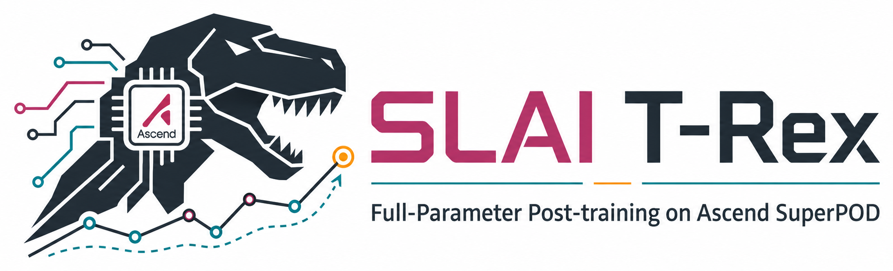
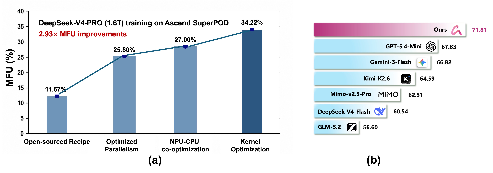

<p align="center">
  
</p>

<p align="center">
  <a href="README.md">English</a> | <b>中文</b>
</p>

<p align="center">
  <a href="docs/SLAI-T-Rex.pdf"></a>
  <a href="https://www.modelscope.cn/models/SLAIAITP/DeepSeek-V4-Flash-OR"></a>
  <a href="https://github.com/SLAI-AITP/SLAI-T-Rex"></a>
  <br>
  
  
  
  
</p>

# SLAI T-Rex

技术报告配套开源仓库：[SLAI T-Rex: Full-Parameter Post-training of the DeepSeek-V4 Family on Ascend SuperPOD](docs/SLAI-T-Rex.pdf)。

- **模型：** [SLAIAITP/DeepSeek-V4-Flash-OR](https://www.modelscope.cn/models/SLAIAITP/DeepSeek-V4-Flash-OR)
- **代码：** [SLAI-AITP/SLAI-T-Rex](https://github.com/SLAI-AITP/SLAI-T-Rex)
- **训练镜像：** `quay.io/slai-t-rex/slai-t-rex:v1.0.0-a3-cann9.1.0`

报告研究在 Ascend CloudMatrix384 SuperPOD（910C）上对 DeepSeek-V4 做全参数后训练。本仓库提供可复现部分：OR CPT/SFT 数据构建、MindSpeed-LLM 启动模板、checkpoint 转换、OR benchmark 评测。

两条主线：

- **系统扩展：** 万亿参数级 MoE 在 Ascend SuperPOD 上的训练（并行、通信、CPU–NPU 协同、AscendC 算子）。
- **领域专精：** 面向 Operations Research，对 DeepSeek-V4-Flash 做 solver-grounded CPT、自蒸馏 SFT 与 benchmark 验证。

<p align="center">
  
</p>

## 报告要点

- DeepSeek-V4-Pro 训练 **34.22% MFU**，相对开源 baseline **2.93x**。
- **AuraKernel：** 面向 AscendC 的瓶颈算子优化（sparse attention、RMSNorm、lightning indexer gradient、RoPE、limited SwiGLU、mHC 相关算子链）。
- DeepSeek-V4-Flash 的 **OR CPT–SFT**：OR 资源收集、solver-verified 合成文档、自蒸馏 SFT、Clean-CoT 质量门。
- **10K** 高质量 SFT 样本（4 类 OR 任务、3 种问题表示）。
- NL4OPT / OptiBench / B4O-Feasible / B4O-ORGEval 平均 zero-shot Pass@1 **71.81%**（报告对比中高于 GPT-5.4-Mini 3.98 点、高于 base DeepSeek-V4-Flash 11.27 点）。
- CPT→SFT 迁移（相同 SFT）：B4O-Feasible **71.22%**，B4O-ORGEval **59.39%**。

## 结构

```text
SLAI-T-Rex/
├── data/cpt/            OR-CPT engine（solver-verified 合成）
├── data/sft/            OR SFT 蒸馏工具
├── training/convert/    数据与 checkpoint 转换
├── training/common/     MindSpeed 运行时路径公共解析
├── training/cpt/        DeepSeek-V4 Flash/Pro 4K CPT 启动
├── training/sft/        DeepSeek-V4 Flash 8K 与 Pro 4K SFT 启动
├── eval/                OR benchmark
├── docs/                技术报告 PDF
└── assets/
```

| 模块 | 状态 | 作用 |
| --- | --- | --- |
| [data/cpt](data/cpt/) | 可运行 | OptMATH 生成器 → Gurobi → NL 反写 → CPT JSONL |
| [data/sft](data/sft/) | 可运行 | seed / synthetic IR → 渲染 → 质量门 → OpenAI-style SFT JSONL |
| [training/convert](training/convert/) | 脚本 | MindSpeed 数据转换；HF / MCore / FP8 checkpoint |
| [training/cpt](training/cpt/) | 脚本 | MindSpeed-LLM 4K CPT |
| [training/sft](training/sft/) | 脚本 | MindSpeed-LLM 8K SFT |
| [eval](eval/) | 可运行 | NL4OPT、OptiBench、B4O-Feasible、B4O-ORGEval |

```text
checkpoint 准备 -> CPT 数据 -> CPT 训练 -> SFT 数据 -> SFT 训练 -> 评测
```

大规模生产数据、私有集群配置和内部评测产物不随仓库发布。训练脚本面向已准备好的 Ascend / MindSpeed 环境，不内置 MindSpeed-LLM、CANN 或集群启动器。

## 预构建训练镜像

面向 Ascend A3 和 CANN 9.1.0 的训练镜像已发布到 Quay.io，可直接拉取：

```bash
docker pull quay.io/slai-t-rex/slai-t-rex:v1.0.0-a3-cann9.1.0
```

镜像构建版本、内容和自行构建方法见[训练镜像搭建指南](docs/IMAGE_BUILD_GUIDE_zh.md)。

## 快速开始

SFT 数据 dry-run（不调用 LLM）：

```bash
git clone https://github.com/SLAI-AITP/SLAI-T-Rex.git
cd SLAI-T-Rex/data/sft
python3 -m pip install -e .
python3 -m or_data_distill validate-sft --input seeds/public_seed.jsonl
python3 -m or_data_distill run --config examples/configs/demo.yaml --dry-run
```

真实生成：复制 `configs/run.example.yaml`，填写 `llm.base_url` / `model`，再执行 `python3 -m or_data_distill run --config configs/run.local.yaml`。

CPT engine 冒烟（seed factory 需要 `gurobipy`；LLM 阶段需要 OpenAI-compatible 接口）：

```bash
cd SLAI-T-Rex/data/cpt
python3 -m pip install -e .
python3 -m or_cpt_engine.cli.main --help
```

训练、转换与评测命令见上表各模块 README。

## 训练默认值

| Recipe | Seq / GBS | Iters / LR | 并行配置 |
| --- | --- | --- | --- |
| Flash CPT | 4096 / 128 | 280 / 3e-6 | TP=1, PP=4, EP=32 |
| Flash SFT | 8192 / 128 | 250 / 5e-6 | TP=1, PP=4, EP=32 |
| Pro CPT | 4096 / 256 | 45 / 1e-6 | TP=2, PP=8, EP=64 |
| Pro SFT | 4096 / 1024 | 2000 / 1e-5 | TP=2, PP=8, EP=64 |

数据、tokenizer、初始权重和输出路径均通过环境变量传入。训练脚本会自动查找与 SLAI-T-Rex 同级的 MindSpeed 仓库，也可显式设置 `MINDSPEED_LLM_DIR`、`MINDSPEED_DIR` 和 `MEGATRON_DIR`。修改默认值前请先对齐硬件拓扑、checkpoint 格式、tokenizer 和 packing。

## 引用

```bibtex
@misc{li2026slaitrexfullparameterposttraining,
      title={SLAI T-Rex: Full-Parameter Post-training of the DeepSeek-V4 Family on Ascend SuperPOD}, 
      author={Dongfang Li and Xiaodong Luo and Ruoyu Sun and Xuhui Chen and Linyuan Qiu and Jian Meng and Zhengxuan Lu and Yiting Wang and Yucheng Xie and Tao Guo and Tianxiang Fang and Jing Li and Sihang Chen and Shihao Hong and Chang Liu and Weihua Dai and Zirong Zeng and Ziwei Zhu and Zhuohan Wang and Zhengjun Yue and Igor Vasilyev and Min Liu and Weijian Sun and Xin Chen and Yingmeng Gao and Jinhua Zhou and Taolue Chen and Chenwei Wu and Dong Zhang and Wenlong Jin and Jinmin Xiang and Barkova Maria and Ushakov Anton and Xianfei Jin and Tian Ding and Zhihang Lin and Qian Chen and Linxin Yang and Mingzhe Yang and Bingwei Zhang and Hongzhang Yang and Fangxue Zhang and Shijun Qin and Jie Yu and Cuihua Hu and Tolstykh Vasiliy and Nosov Ivan and Abdullin Amir and Zhicheng Zhou and Xin Zhang and Zhixiong Ning and Xutong Zhao and Junjie Huang and Jiajun Liu and Weiyan Kong and Zheng Zhang and Wenhan Luo and Lin Hu and Yangbo Guo and Li Zeng and Shihao Zhang and Baotian Hu and Min Zhang and Haizhou Li and Zhiquan Luo},
      year={2026},
      eprint={2607.20145},
      archivePrefix={arXiv},
      url={https://arxiv.org/abs/2607.20145}, 
}
```
